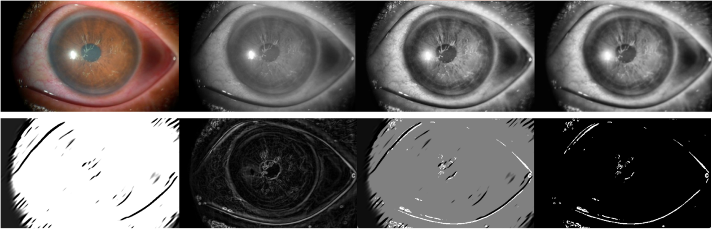
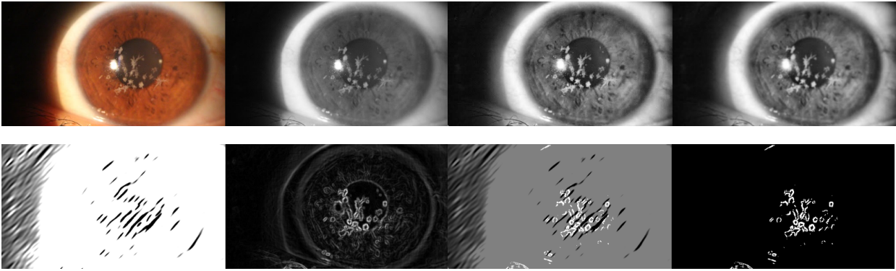

# Desafio Processamento Digital de Imagens
Trabalho final entregue para a disciplina optativa de Processamento Digital de Imagens

### Processamento de Imagens para detecção de Ceratite Automaticamente

**Objetivo**

Identificar a presença de possíveis sinais de ceratite (manchas na córnea) em imagens de olhos
- A detecção de ceratite é crucial para prevenir danos graves à córnea.
- A ceratite provoca manchas visíveis na córnea, impactando a visão.
- Técnicas de processamento de imagens ajudam a identificar ceratite em fotos da córnea.

**Conjunto de dados**

Imagens obtidas pelos autores utilizando uma câmera de celular combinadas com fotos cedidas por oftalmologistas

**Aquisição & Pré-processamento**

- Os testes foram realizados usando 3 imagens com ceratite e outras 3 de olhos saudáveis
- O pré-processamento manual foi realizado para equalizar o tamanho e formato das imagens
- Conversão para escalada de cinza, destacando os detalhes da córnea e íris
- Equalização Adaptativa de CLAHE para realçar detalhes da córnea
- Borreamento Gaussiano para remover ruídos

**Processamento**

- Combinamos dois algoritmos diferentes para o processamento 
- Análise de textura de Gabor, para analisar a córnea e obter padrões ou irregularidades
- Máscara de Sobel para detecção de bordas
- Os dois resultados foram combinados fazendo uma adição com pesos, de 0.5 para cada
- O resultado foi convertido para uma imagem binária

